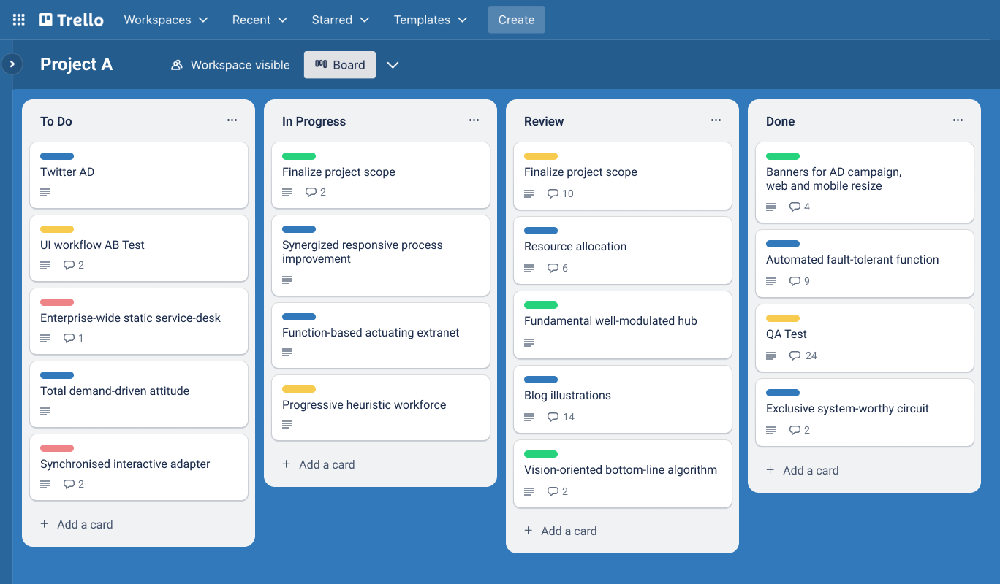
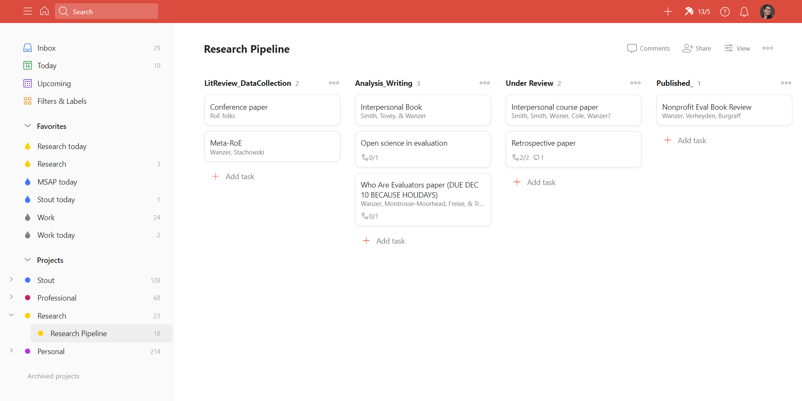
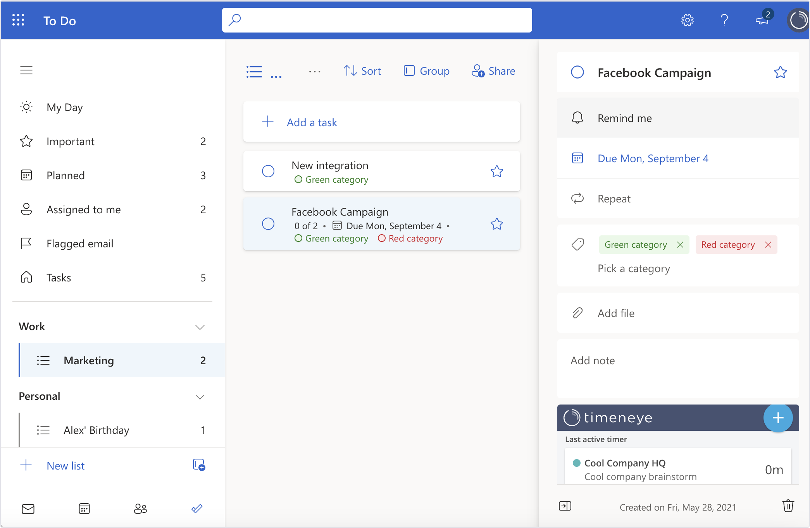

# Анализ аналогов веб-приложения

# Цель

Определить преимущества и недостатки аналогов разрабатываемого веб-приложения

# Список аналогов

- [Trello](https://trello.com/)
- [Todoist](https://todoist.com/)
- [Weeek](https://weeek.net/)
- [Microsoft To Do](https://to-do.office.com/tasks/)

# Основные функции и возможности

Во всех перечисленных системах присутсвуют следующие функции:

- создание задач
- синхронизация с календарем
- система приоритетов
- сортировка задач
- мобильные версии
- интеграции с другими сервисами
- уведомления
- платные микросервисы
- групповые проекты

Weeek предоставляет бесплатный доступ к синхронизации с календарем, уведомления через социальную сеть Telegram, обширный бесплатный план и доступный платный план.
Однако интерфейс является перегруженным и неотзывчивым как и в веб версии, так и в мобильном приложении.
Отличительными особенностями Weeek являются уведомления через социальную сеть Telegram и интеграция с популярными калернадрными сервисами.

Trello отличается простотой и отзывчивостью интерфейса, гибкостью использования и обширным набором дополнительных функций платной версии. В то же время бесплатный план крайне ограничивает возможности пользователя: отсутсвие коллабораций, органичения в количестве проектов и интергрированных сервисов. Кроме того, сервис сильно зависит от интернет соединения и ограниченную систему уведомлений.
Основные отличительные черты Trello - это фукнции автоматизации действий и Power-Ups.
Автоматизация добивается встроенным инструментов Butler, в котором можно задач ряд определенных действий, срабатывающих по триггеру.
Power-Ups - это система пользовательских дополнений, интегрируемых с систему.

Todoist имеет приятный отзывчивый интерфейс как в веб, так и в мобильной версии, а также множество полезных функций. Недостатками данной системы является то, что множество предлагаемых функций недоступны в бесплатной версии, отсутствие тайм-трекинга, и чрезмерное упрощение интерфейса.
Приложение предоставляет пользователю систему меток и фильтров. Метки используются для классификации задач по тегам, а фильтры позволяют выводить список задач по нескольким критериям: теги, дата и время, приоритет и д.р., например: "Сегодня & @работа".

Microsoft To Do является простым менеджером задач с обширной интеграцией в приложениях Microsoft и облачной сихронизацией, что позволяет получить доступ к данным из любого приложения или устройства и отличается от аналогов отсутсвием платной версии. В то же время, по сравнению с другими аналогами у него крайне ограниченный функционал.

# Особенность разрабатываемого веб-приложения

По сравнению с аналогами, основной особенностью разрабатываемого веб-приложения является автоматизация сортировки задач по метологии "Getting Things Done", сохраняя простые и полезные функции таких аналогов, например: таблицы, тайм-трекинг и уведомления. Но слабой частью проекта является отсутствие мобильной версии и интеграции в сторонние приложения, а также зависимость от интернет соединения.
